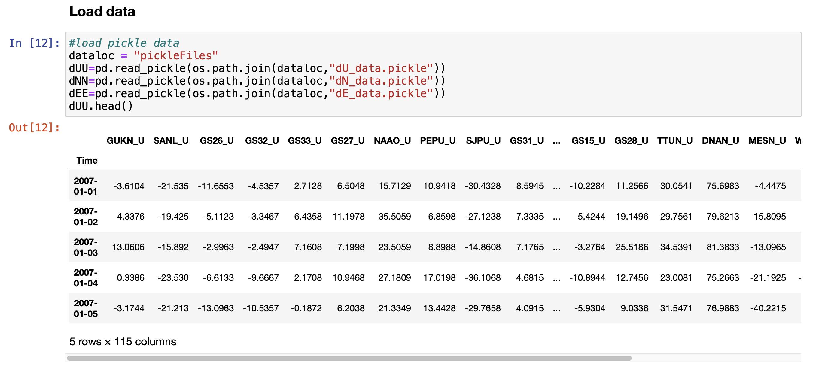

# Dynamic Time Warping based Hierarchical Agglomerative Clustering

Codes to perform Dynamic Time Warping Based Hierarchical Agglomerative Clustering of GPS data

## Details

This package include codes for processing the GPS displacement data including least-square modelling for trend, co-seismic jumps, 
seasonal and tidal signals. Finally, it can be used to cluster the GPS displacements based on the similarity of the waveforms. The
similarity among the waveforms will be obtained using the DTW distance.

__author__: Utpal Kumar
__date__: 2021/06

## Usage
### Least-squares modeling



```
from dtwhaclustering.leastSquareModeling import lsqmodeling
final_dU, final_dN, final_dE = lsqmodeling(dUU, dNN, dEE,stnlocfile="helper_files/stn_loc.txt",  plot_results=True, remove_trend=False, remove_seasonality=True, remove_jumps=False)
```


## License
© 2021 Utpal Kumar

Licensed under the Apache License, Version 2.0