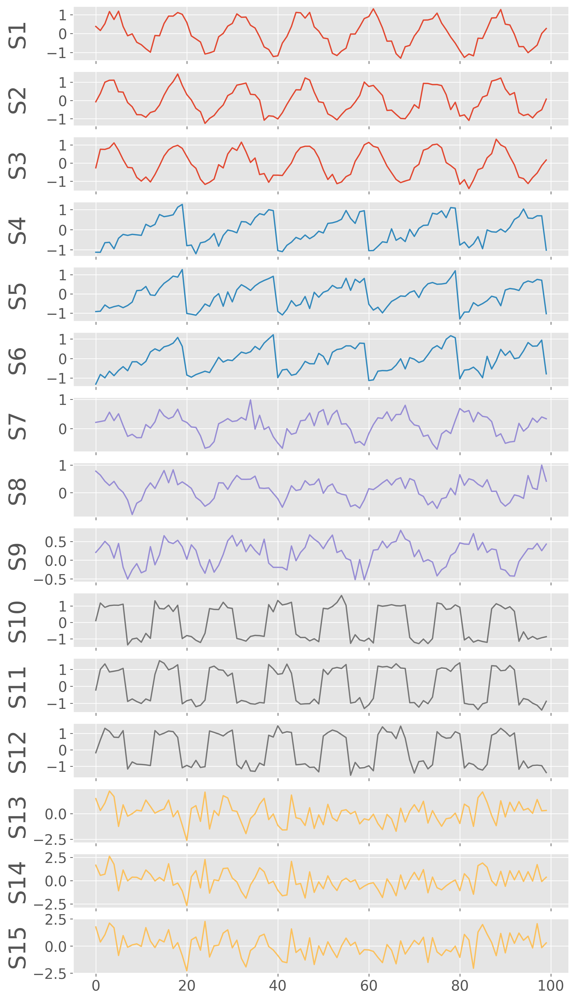

Clustering Analysis
====================

Create signals for analysis
----------------------------

.. code-block:: python

    from dtwhaclustering.dtw_analysis import dtw_signal_pairs, dtw_clustering, plot_signals, shuffle_signals, plot_cluster
    import numpy as np
    from scipy import signal
    import matplotlib.pyplot as plt
    from dtaidistance import dtw
    from scipy.cluster.hierarchy import fcluster

    from scipy.cluster.hierarchy import dendrogram
    from sklearn.cluster import AgglomerativeClustering
    
    np.random.seed(0)
    # sampling parameters
    fs = 100   # sampling rate, in Hz
    T  = 1      # duration, in seconds
    N  = T * fs # duration, in samples
    M  = 5      # number of sources
    R  = 3      # number of copies
    MR = M * R 

    # time variable
    t = np.linspace(0, T, N)

    S1 = np.sin(2 * np.pi * t * 7)
    S2 = signal.sawtooth(2 * np.pi * t * 5)
    S3 = np.abs(np.cos(2 * np.pi * t * 3)) - 0.5
    S4 = np.sign(np.sin(2 * np.pi * t * 8))
    S5 = np.random.randn(N)

    time_series = np.array([S1, S2, S3, S4, S5])

    fig, ax = plot_signals(time_series)
    plt.show()

.. image:: ../../../images/base_functions.pdf

Add noise and make 3 copies of each signal
-------------------------------------------

.. code-block:: python

    SNR = 0.2
    X0 = np.tile(S1, (R, 1)) + np.random.randn(R, N) * SNR 
    X1 = np.tile(S2, (R, 1)) + np.random.randn(R, N) * SNR 
    X2 = np.tile(S3, (R, 1)) + np.random.randn(R, N) * SNR 
    X3 = np.tile(S4, (R, 1)) + np.random.randn(R, N) * SNR 
    X4 = np.tile(S5, (R, 1)) + np.random.randn(R, N) * SNR 
    X = np.concatenate((X0, X1, X2, X3, X4))

    color = ['C0']*3+['C1']*3+['C2']*3+['C3']*3+['C4']*3
    fig, ax = plot_signals(X,figsize=(10,20), color=color)
    plt.show()

Geographically distribute the signals
--------------------------------------

Now, we have 15 signals in total. Let us also randomly make these signals distributed in geographical space by assigning them longitudes and latitudes. We assume that the signals with similar waveforms are geographically co-located.

.. code-block::

    S0 variants (S0, S1, S2) -> xrange(0-3) yrange(7-10)
    S1 variants (S3, S4, S5) -> xrange(1-4) yrange(3-5)
    S2 variants (S6, S7, S8) -> xrange(4-8) yrange(4-6)
    S3 variants (S9, S10, S11) -> xrange(5-10) yrange(0-4)
    S4 variants (S12, S13, S14) -> xrange(5-9) yrange(6-9)

.. code-block:: python

    S0_lons = np.random.uniform(0, 3, 3)
    S0_lats = np.random.uniform(7, 10, 3)

    S1_lons = np.random.uniform(1, 4, 3)
    S1_lats = np.random.uniform(3, 5, 3)

    S2_lons = np.random.uniform(4, 8, 3)
    S2_lats = np.random.uniform(4, 6, 3)

    S3_lons = np.random.uniform(5, 10, 3)
    S3_lats = np.random.uniform(0, 4, 3)

    S3_lons = np.random.uniform(5, 10, 3)
    S3_lats = np.random.uniform(0, 4, 3)

    S4_lons = np.random.uniform(5, 9, 3)
    S4_lats = np.random.uniform(6, 9, 3)

    lons = np.concatenate((S0_lons, S1_lons, S2_lons, S3_lons, S4_lons))
    lats = np.concatenate((S0_lats, S1_lats, S2_lats, S3_lats, S4_lats))

    plot_cluster(lons,lats)
    # plt.show()
    plt.savefig("signals_locations.pdf", bbox_inches='tight')

.. image:: ../../../images/signals_locations.pdf

Reshuffle the noisy signals
----------------------------

.. code-block:: python

    shuffled_idx, shuffled_matrix = shuffle_signals(X, labels=[], plot_signals=False, figsize=(10, 20))
    shuffled_lons = lons[shuffled_idx]
    shuffled_lats = lats[shuffled_idx]

    labels = np.array(['S1a', 'S1b', 'S1c','S2a', 'S2b', 'S2c','S3a', 'S3b', 'S3c','S4a', 'S4b', 'S4c','S5a', 'S5b', 'S5c'])
    newlabels = labels[shuffled_idx]

    color = np.array(color)
    color = color[shuffled_idx]
    fig, ax = plot_signals(shuffled_matrix,figsize=(10,20), color=color, labels=newlabels)
    plt.savefig("shuffled_signals.pdf", bbox_inches='tight')

.. image:: ../../../images/shuffled_signals.pdf

Cluster reshuffled signals
---------------------------

.. code-block:: python

    dtw_cluster2 = dtw_clustering(shuffled_matrix, labels=newlabels, longitudes=shuffled_lons, latitudes=shuffled_lats)
    dtw_cluster2.plot_dendrogram(annotate_above=3,xlabel="Signals", figname="example_dtw_cluster.png",distance_threshold="optimal")

.. image:: ../../../images/example_dtw_cluster.pdf

In the above dendrogram, we manually selected the threshold distance to be 3 to find the best clusters

Plot the geographical locations of the clusters
------------------------------------------------

.. code-block:: python

    dtw_cluster2.plot_cluster_xymap(dtw_distance=3, figname=None, xlabel='', ylabel='', fontsize=40, markersize=200, tickfontsize=30, cbarsize=40)
    plt.savefig("signals_cluster_xy_map.pdf", bbox_inches='tight', edgecolors='black', linewidths=5)

.. image:: ../../../images/signals_cluster_xy_map.pdf

Polar dendrogram
-----------------

.. code-block:: python

    kwargs_dendro={
    "plotstyle":'seaborn', 
    "linewidth":5,
    "gridwidth":0.8,
    "gridcolor":'gray',
    'xtickfontsize':60,
    'ytickfontsize':60,
    "figsize":(40,40), 
    "distance_threshold":"optimal" #use optimal number of clusters estimated by elbow method
    }

    dtw_cluster2.plot_polar_dendrogram(**kwargs_dendro)
    plt.savefig("example_polar_dendro.pdf", bbox_inches='tight')

.. image:: ../../../images/example_polar_dendro.pdf

How the DTW distance changes with iterations to obtain the dendrogram?
----------------------------------------------------------------------

.. code-block:: python

    dtw_cluster2.plot_hac_iteration()
    plt.show()

.. image:: ../../../images/plot_hac_iteration.pdf

.. code-block:: python

    dtw_cluster2.plot_optimum_cluster(legend_outside=False)
    plt.savefig("optimum_clusters.pdf", bbox_inches='tight')

.. image:: ../../../images/optimum_clusters.pdf

Euclidean distance-based cluster
---------------------------------

.. code-block:: python

    
    def compute_linkage(model):
        # create the counts of samples under each node
        counts = np.zeros(model.children_.shape[0])
        n_samples = len(model.labels_)
        for i, merge in enumerate(model.children_):
            current_count = 0
            for child_idx in merge:
                if child_idx < n_samples:
                    current_count += 1  # leaf node
                else:
                    current_count += counts[child_idx - n_samples]
            counts[i] = current_count

        linkage_matrix = np.column_stack([model.children_, model.distances_,
                                        counts]).astype(float)
        return linkage_matrix

    def plot_dendrogram(model, **kwargs):
        # Create linkage matrix and then plot the dendrogram

        linkage_matrix = compute_linkage(model)

        # Plot the corresponding dendrogram
        dendrogram(linkage_matrix, **kwargs)

    #‘ward’ minimizes the variance of the clusters being merged
    model = AgglomerativeClustering(distance_threshold=0, n_clusters=None, affinity='euclidean',linkage='ward')

    model = model.fit(X)

    plt.figure(figsize=(20, 8))
    # plot the top three levels of the dendrogram
    plot_dendrogram(model, p=5, color_threshold=5)
    plt.xticks(fontsize=26)
    plt.yticks(fontsize=26)
    plt.axhline(y=5, c='k')

    plt.xlabel("Signal Indexes")
    plt.savefig('example_euclidean_cluster.pdf',bbox_inches='tight')
    plt.close()

.. image:: ../../../images/example_euclidean_cluster.pdf

Both Euclidean and DTW based clustering results are similar. However, we can see some obvious differences. Let us list some of the similarity and differences for the above example.

- Both the results found 5 significant clusters.
- Both Euclidean and DTW based HAC found that the random function based time series (12, 13, 14) are most dissimilar
- The two closest clusters with DTW is sawtooth (6,7,8) and sine func(0,1,2). While that with the Euclidean, it is abs_cosine (6,7,8) and sawtooth fn (3,4,5)

The two results are similar because the signals considered for this example are stationary in nature. 
