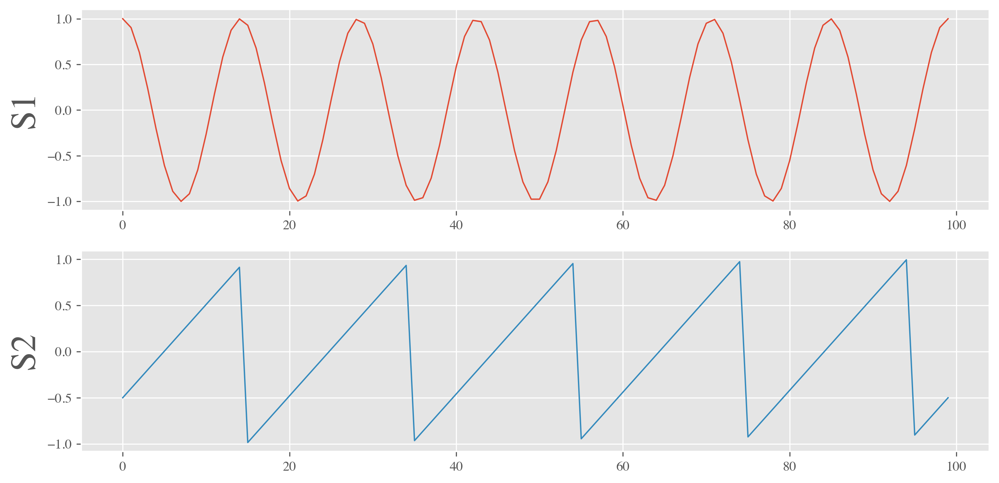
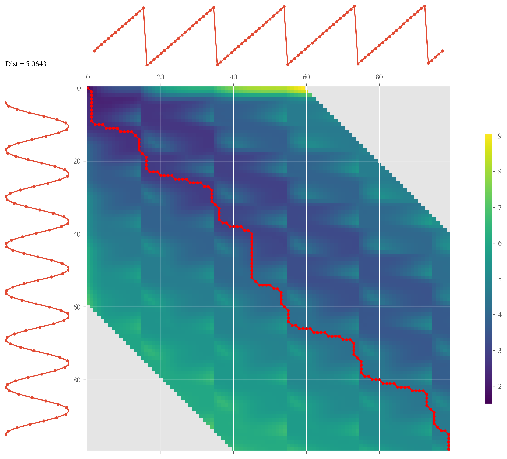

Signal Analysis
================

Create signals for analysis
----------------------------

.. code-block:: python

    np.random.seed(0)
    # sampling parameters
    fs = 100   # sampling rate, in Hz
    T = 1      # duration, in seconds
    N = T * fs  # duration, in samples

    # time variable
    t = np.linspace(0, T, N)

    SNR = 0.2 #noise

    XX0 = np.sin(2 * np.pi * t * 7+np.pi/2) #+ np.random.randn(1, N) * SNR
    XX1 = signal.sawtooth(2 * np.pi * t * 5+np.pi/2) #+ np.random.randn(1, N) * SNR
    s1, s2 = XX0, XX1

Inspect the DTW distance between two signals
---------------------------------------------

.. code-block:: python

    dtwsig = dtw_signal_pairs(s1, s2, labels=['S1', 'S2'])      
    dtwsig.plot_signals()
    plt.show()

Plot warping path
--------------------

.. code-block:: python

    matplotlib.rcParams['pdf.fonttype'] = 42
    distance,_,_ = dtwsig.plot_warping_path()
    print(f"DTW distance between signals: {distance:.4f}")

    plt.savefig("warping_path_s1_s2.pdf", bbox_inches='tight')

DTW distance between signals: 5.2093

.. image:: ../../../images/warping_path_s1_s2.pdf

.. code-block:: python

    dtwsig.plot_matrix(windowfrac=0.6, psi=None) #Only allow for shifts up to 60% of the minimum signal length away from the two diagonals.
    plt.show()

Create multiple signals
------------------------

.. code-block:: python

    fs = 100   # sampling rate, in Hz
    T  = 1      # duration, in seconds

    N  = T * fs # duration, in samples
    M  = 5      # number of sources
    S1 = np.sin(2 * np.pi * t * 7)
    S2 = signal.sawtooth(2 * np.pi * t * 5)
    S3 = np.abs(np.cos(2 * np.pi * t * 3)) - 0.5
    S4 = np.sign(np.sin(2 * np.pi * t * 8))
    S5 = np.random.randn(N)

    time_series = np.array([S1, S2, S3, S4, S5])

    ## instantiate the class
    dtw_cluster = dtw_clustering(time_series,labels=['S1','S2','S3','S4','S5'])

    matplotlib.rcParams['pdf.fonttype'] = 42
    dtw_cluster.plot_signals()
    # plt.show()
    plt.savefig("base_functions.pdf", bbox_inches='tight')

.. image:: ../../../images/base_functions.pdf

Compute the relative DTW distance between the signals
-------------------------------------------------------

.. code-block:: python

    ds = dtw_cluster.compute_distance_matrix(compact=False)

  
.. code-block::

    array([[0.        , 5.15998322, 4.19080907, 5.77875263, 7.95685039],
    [5.15998322, 0.        , 4.74413601, 7.71110741, 9.31343712],
    [4.19080907, 4.74413601, 0.        , 8.75201301, 8.51048008],
    [5.77875263, 7.71110741, 8.75201301, 0.        , 9.18406086],
    [7.95685039, 9.31343712, 8.51048008, 9.18406086, 0.        ]])